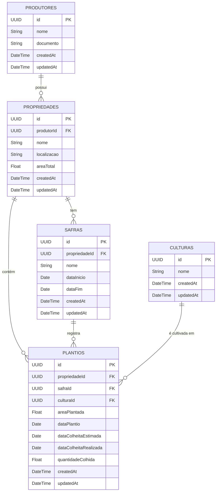

# Agri-Ledger API

## Visão Geral

O Agri-Ledger API é o backend para um sistema de gestão de produtores rurais, suas propriedades, safras e culturas. O objetivo é fornecer uma plataforma robusta, escalável e segura para registrar e gerenciar informações agrícolas, incluindo a capacidade de associar múltiplas culturas a uma única safra por propriedade, facilitando a rastreabilidade e a tomada de decisões.

## Tecnologias Utilizadas

- **Backend:** Node.js, NestJS, TypeScript
- **Banco de Dados:** PostgreSQL
- **ORM:** Sequelize (com PKs UUID para entidades principais)
- **Testes:** Jest (para testes unitários e de integração/e2e)
- **Contêinerização:** Docker
- **Linting e Formatação:** ESLint, Prettier
- **Segurança:** Helmet, CORS, Validação de Dados (class-validator, class-transformer)
- **Documentação da API:** Swagger (OpenAPI) via `@nestjs/swagger`

## Arquitetura

A API segue uma arquitetura em camadas, comum em aplicações NestJS, promovendo separação de responsabilidades e modularidade:

- **Controllers:** Responsáveis por lidar com as requisições HTTP, validar dados de entrada (usando DTOs) e retornar respostas.
- **Services:** Contêm a lógica de negócio principal da aplicação.
- **Models/Repositories:** Camada de acesso a dados, utilizando Sequelize para interagir com o banco de dados PostgreSQL. As entidades principais (`Produtor`, `Propriedade`, `Safra`, `Cultura`, `Plantio`) utilizam UUID como chaves primárias.
- **Modules:** Agrupam componentes relacionados (controllers, services, models) por funcionalidade.

_Diagramas de arquitetura e fluxo de dados podem ser adicionados à pasta `/docs/diagrams` para visualização detalhada._

## Modelo de Dados Detalhado

A API Agri-Ledger utiliza um modelo de dados relacional para gerenciar as informações agrícolas. As chaves primárias de todas as entidades principais são do tipo UUID para garantir identificadores únicos e distribuídos.

### Entidades Principais e Relacionamentos



**Descrições das Entidades:**

- **Produtores (`produtores`)**: Armazena informações sobre os produtores rurais.
  - `id`: UUID, Chave Primária.
  - `nome`: Nome do produtor.
  - `documento`: Documento (CPF/CNPJ), único.
- **Propriedades (`propriedades`)**: Representa as propriedades pertencentes aos produtores.
  - `id`: UUID, Chave Primária.
  - `produtorId`: UUID, Chave Estrangeira referenciando `produtores.id`.
  - `nome`: Nome da propriedade.
  - `localizacao`: Descrição textual ou coordenadas da localização.
  - `areaTotal`: Área total da propriedade em hectares.
- **Safras (`safras`)**: Define os períodos de safra para cada propriedade.
  - `id`: UUID, Chave Primária.
  - `propriedadeId`: UUID, Chave Estrangeira referenciando `propriedades.id`.
  - `nome`: Nome/identificador da safra (ex: "Safra Soja 2024/2025").
  - `dataInicio`: Data de início da safra.
  - `dataFim`: Data de término da safra.
- **Culturas (`culturas`)**: Tabela de lookup para os tipos de culturas (ex: Soja, Milho, Café).
  - `id`: UUID, Chave Primária.
  - `nome`: Nome da cultura, único.
- **Plantios (`plantios`)**: Tabela de junção que registra o plantio de uma cultura específica, em uma determinada área de uma propriedade, durante uma safra.
  - `id`: UUID, Chave Primária.
  - `propriedadeId`: UUID, Chave Estrangeira referenciando `propriedades.id`.
  - `safraId`: UUID, Chave Estrangeira referenciando `safras.id`.
  - `culturaId`: UUID, Chave Estrangeira referenciando `culturas.id`.
  - `areaPlantada`: Área plantada com a cultura em hectares.
  - `dataPlantio`: Data em que o plantio foi realizado.
  - `dataColheitaEstimada`: Data estimada para a colheita.
  - `dataColheitaRealizada`: Data real da colheita (opcional).
  - `quantidadeColhida`: Quantidade colhida (opcional).

Este modelo permite que uma `Propriedade` tenha múltiplas `Safras`, e dentro de cada `Safra` em uma `Propriedade`, múltiplos `Plantios` de diferentes `Culturas` podem ser registrados, cada um com sua `areaPlantada` específica.

## Como Começar

### Pré-requisitos

- Node.js (versão >= 18.x recomendada)
- Yarn ou NPM
- Docker e Docker Compose (para ambiente de desenvolvimento com banco de dados)
- PostgreSQL (se não for utilizar Docker para o banco)

### Configuração do Ambiente

1. **Clone o repositório:**

    ```bash
    git clone https://github.com/seu-usuario/agri-ledger.git
    cd agri-ledger/backend
    ```

2. **Instale as dependências:**

    ```bash
    npm install
    # ou
    # yarn install
    ```

3. **Configure as variáveis de ambiente:**

    - Copie o arquivo `.env.example` (se existir) para `.env` na pasta `backend`.
    - Preencha as variáveis de ambiente necessárias, como:

      ```env
      # Configurações da Aplicação
      PORT=3000
      NODE_ENV=development

      # Configurações do Banco de Dados PostgreSQL com Sequelize
      DB_DIALECT=postgres
      DB_HOST=localhost
      DB_PORT=5432
      DB_USERNAME=seu_usuario_db
      DB_PASSWORD=sua_senha_db
      DB_DATABASE=agri_ledger_db

      # Configurações de Segurança
      JWT_SECRET=seu_segredo_super_secreto_aqui # Alterar em produção!
      # API_KEY=sua_api_key_segura # Se estiver usando uma API Key global adicional
      ```

    _Nota: Para produção, utilize segredos fortes e gerenciados (ex: Google Secret Manager, AWS Secrets Manager, HashiCorp Vault). O `JWT_SECRET` é crucial para a segurança dos tokens de autenticação._

4. **(Opcional) Suba o banco de dados com Docker Compose:**

    Se houver um `docker-compose.yml` configurado para o banco:

    ```bash
    docker-compose up -d postgres_db # Substitua 'postgres_db' pelo nome do serviço do banco no docker-compose.yml
    ```

    Caso contrário, certifique-se de que uma instância do PostgreSQL esteja rodando e acessível.

5. **Rode as migrations do Sequelize:**

    Antes de rodar as migrations, se você possuía uma versão anterior do banco de dados desta aplicação, será necessário limpar as tabelas existentes, pois a estrutura foi significativamente alterada (incluindo a mudança de chaves primárias para UUID e a introdução da tabela `Plantio`).

    ```bash
    # Conecte-se ao seu PostgreSQL e execute os comandos DROP TABLE para as tabelas antigas se necessário.
    # Ex: DROP TABLE IF EXISTS plantios, culturas, safras, propriedades, produtores, "SequelizeMeta";
    ```

    Com o banco de dados limpo (ou para uma nova configuração), execute a migration para criar o schema:

    ```bash
    npm run migration:run
    ```

    Isso criará as tabelas no banco de dados conforme definido nos modelos Sequelize e nas migrations.

## Autenticação e Autorização

A API utiliza JSON Web Tokens (JWT) para autenticação e um sistema de papéis (Roles) para autorização.

### Fluxo de Autenticação

1. **Login**: O usuário envia credenciais (CPF/CNPJ e senha) para o endpoint `POST /auth/login`.
   - Se as credenciais forem válidas, a API retorna um `access_token` (JWT).
2. **Acesso a Endpoints Protegidos**: Para acessar endpoints que requerem autenticação, o cliente deve incluir o `access_token` no cabeçalho `Authorization` como um Bearer Token.
   - Exemplo: `Authorization: Bearer <seu_access_token>`

### Criação de Usuário e Primeiro Admin

- O endpoint `POST /produtores` é **público**. Isso permite que novos produtores (usuários) sejam cadastrados.
- Ao criar um produtor, pode-se especificar seus `papeis` (roles). Para criar um administrador, inclua `"admin"` na lista de papéis.
- **Importante**: Recomenda-se que, após a criação do primeiro usuário administrador, medidas adicionais possam ser implementadas para restringir a criação de novos administradores ou até mesmo tornar o endpoint `POST /produtores` protegido, dependendo dos requisitos de segurança da aplicação em produção.

### Papéis (Roles)

Existem dois papéis principais definidos:

- `admin`: Tem acesso total a todos os recursos da API.
- `generico`: Tem acesso limitado, geralmente a visualizar e gerenciar apenas seus próprios dados (essa granularidade fina pode ser implementada nos serviços conforme necessário).

Endpoints específicos no `ProdutorController` (e outros que vieram a ser criados) são protegidos usando `@UseGuards(JwtAuthGuard, RolesGuard)` e decorados com `@Roles(Role.Admin)` ou `@Roles(Role.Admin, Role.Generico)` para especificar quais papéis têm permissão.

### Segredo JWT

O `JWT_SECRET` usado para assinar e verificar os tokens é configurado através de variáveis de ambiente para maior segurança, conforme especificado no arquivo `.env`.

## Documentação da API (Swagger)

A documentação interativa da API, gerada com Swagger (OpenAPI), está disponível em `/api-docs` quando a aplicação está rodando (ex: `http://localhost:3000/api-docs`).

A documentação Swagger:

- Lista todos os endpoints disponíveis.
- Mostra quais endpoints são protegidos e requerem autenticação (geralmente marcados com um ícone de cadeado).
- Permite testar o fluxo de autenticação:
  1. Use o endpoint `POST /auth/login` para obter um token.
  2. Clique no botão "Authorize" no Swagger UI e cole o `access_token` (prefixado com `Bearer`) para autenticar suas requisições na interface.
- Detalha os DTOs (Data Transfer Objects) para request e response bodies.

## Testes

O projeto utiliza Jest para testes unitários e de integração.

- **Rodar todos os testes (unitários e e2e):**

  ```bash
  npm run test
  ```

- **Rodar testes e gerar relatório de cobertura:**

  ```bash
  npm run test:cov
  ```

  O relatório de cobertura será gerado na pasta `coverage/lcov-report/index.html`.

- **Rodar apenas os testes de integração (e2e):**

  ```bash
  npm run test:e2e
  ```

- **Rodar apenas os testes unitários:**
  (Pode ser necessário configurar um script específico ou usar o Jest CLI diretamente)

  ```bash
  npm run test:unit # Se configurado no package.json, ou:
  # jest --config jest.config.js src # Exemplo, ajuste conforme necessário
  ```

## Build e Deploy

### Build com Docker

1. Navegue até a pasta `backend`.
2. Construa a imagem Docker:

    ```bash
    docker build -t agri-ledger-api:latest .
    ```

### Deploy no Google Cloud Run

1. **Autentique-se no Google Cloud:**

    ```bash
    gcloud auth login
    gcloud auth configure-docker
    ```

2. **Defina o ID do seu projeto Google Cloud:**

    ```bash
    export PROJECT_ID="seu-gcp-project-id"
    gcloud config set project $PROJECT_ID
    ```

3. **Construa e envie a imagem para o Artifact Registry (ou Container Registry):**

    (Assumindo que você tem um repositório Docker chamado `agri-ledger-repo` na região `us-central1`)

    ```bash
    docker tag agri-ledger-api:latest us-central1-docker.pkg.dev/$PROJECT_ID/agri-ledger-repo/agri-ledger-api:latest
    docker push us-central1-docker.pkg.dev/$PROJECT_ID/agri-ledger-repo/agri-ledger-api:latest
    ```

4. **Faça o deploy no Cloud Run:**

    ```bash
    gcloud run deploy agri-ledger-service \
      --image us-central1-docker.pkg.dev/$PROJECT_ID/agri-ledger-repo/agri-ledger-api:latest \
      --platform managed \
      --region us-central1 \
      --allow-unauthenticated \
      --port 8080 \ # Porta que o Cloud Run expõe, o Dockerfile deve expor a porta da aplicação (ex: 3000)
      --set-env-vars NODE_ENV=production,PORT=3000,DB_HOST=...,DB_PORT=...,DB_USERNAME=...,DB_PASSWORD=...,DB_DATABASE=... # E outras variáveis de ambiente
    ```

    _Importante: Para `DB_HOST` no Cloud Run, configure o IP da instância do Cloud SQL ou use o Socket de Conexão do Cloud SQL. As senhas e segredos devem ser gerenciados via Secret Manager e referenciados nas variáveis de ambiente do Cloud Run._

## Scripts Úteis (definidos em `package.json`)

- `npm run build`: Compila o código TypeScript para JavaScript.
- `npm run format`: Formata o código usando Prettier.
- `npm run start`: Executa a aplicação em modo de produção (após o build).
- `npm run start:dev`: Executa a aplicação em modo de desenvolvimento com watch (nodemon).
- `npm run start:debug`: Executa a aplicação em modo de debug com watch.
- `npm run lint`: Executa o ESLint para análise estática do código.
- `npm run test`: Roda todos os testes.
- `npm run test:watch`: Roda os testes em modo watch.
- `npm run test:cov`: Roda os testes e gera o relatório de cobertura.
- `npm run test:debug`: Roda os testes em modo de debug.
- `npm run test:e2e`: Roda especificamente os testes e2e.
- `npm run migration:generate <path/to/MigrationName>`: Gera um novo arquivo de migration do Sequelize (ex: `npm run migration:generate src/database/migrations/AlterTableAddColumn`).
- `npm run migration:run`: Aplica as migrations pendentes. Para uma nova configuração, cria o schema inicial.
- `npm run migration:revert`: Reverte a última migration aplicada.

## Contribuição

Contribuições são bem-vindas! Por favor, siga estas diretrizes:

1. Faça um fork do projeto.
2. Crie uma branch para sua feature (`git checkout -b feature/nova-feature`).
3. Faça commit de suas mudanças (`git commit -am 'Adiciona nova feature'`).
4. Faça push para a branch (`git push origin feature/nova-feature`).
5. Abra um Pull Request.

Certifique-se de que os testes passam e que o código segue os padrões de linting.

## Licença

Este projeto é licenciado sob a Licença MIT. Veja o arquivo `LICENSE` na raiz do projeto para mais detalhes.
